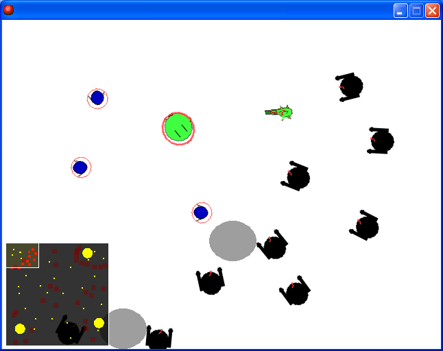

# 좀비의습격

변이하는 좀비 떼와 싸우면서 검과 총을 바꿔 쓰는 액션 게임이다. 게임메이커 커뮤니티 이벤트에 내려고 만들었다.

  

## 플레이 방법

Releases에서 받아 압축을 풀고 실행한다. 오프닝 동영상이 같은 폴더에 있어야 하므로 폴더째 풀어야 한다.

WASD로 움직이고 마우스로 조준해 공격한다. 1과 2로 검과 총을 바꿔 든다. 맵을 돌아다니는 바이러스에 닿은 좀비는 변이한다. 화면 왼쪽 아래에 미니맵이 있다.

## 파일

| 경로 | 내용 |
|---|---|
| `source/zombie-assault.gmk` | 원본 프로젝트 파일 |
| `source/split/` | GmkSplitter로 분해한 텍스트 트리 |
| `docs/screenshots/` | 스크린샷 |
| Releases | 배포용 파일 |

## 크레딧

`source/split/Scripts/` 의 `scr_MDXMAP_*` 는 Midx가 만든 MDX-Minimap 라이브러리다.

## 라이선스

CC BY-NC-ND 4.0 라이선스다. 출처를 밝히면 비상업 용도로 그대로 공유할 수 있고, 수정본 배포와 상업적 이용은 금지한다. 함께 들어 있는 것 중 다른 사람이 만든 라이브러리와 그림·소리·맵은 각자의 권리를 따른다. 자세한 내용은 [LICENSE](LICENSE) 에 있다.
